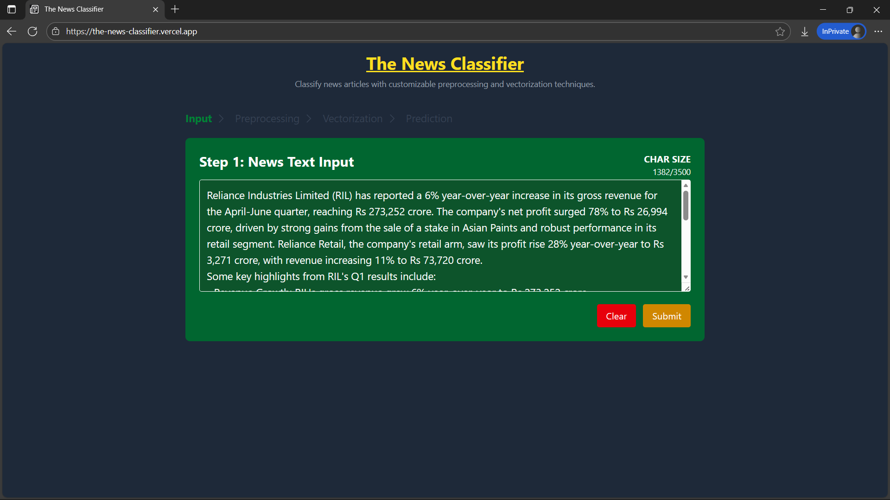
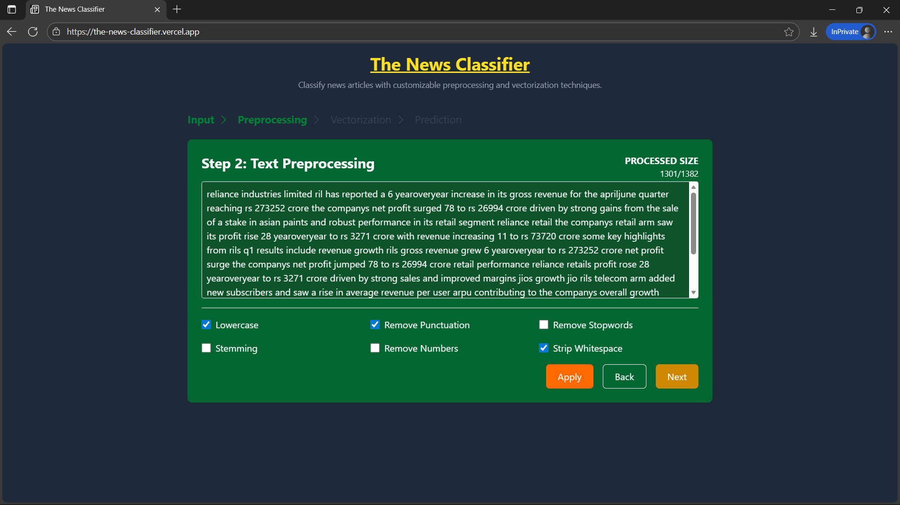
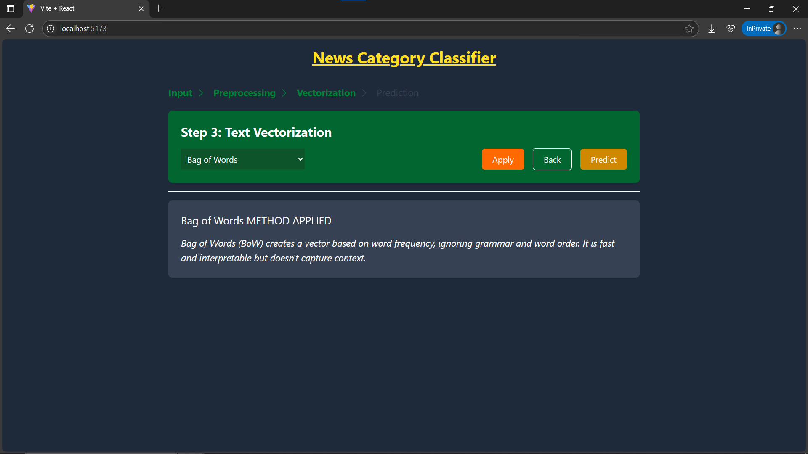
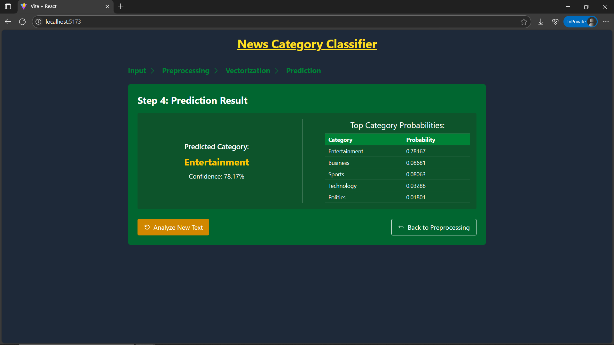

# 📰 📰 NewsClassifier

A web-based application that classifies news articles into categories like **Business**, **Politics**, **Sports**, **Technology** and **Entertainment** using various NLP techniques and machine learning models.

🚀 Live Demo: [View App](https://news-classifier.vercel.app)

---

## ✨ Features

- 🔍 Preprocessing customization (lowercase, stopwords removal, stemming, etc.)
- 🧠 Choose from 4 vectorization methods: One-Hot, BoW, TF-IDF, N-Gram
- ⚙️ Backend predictions using trained ML models (Logistic Regression)
- 📊 Confidence scores & ordered probability outputs
- 💡 Smart warnings for preprocessing compatibility
- 🧪 Lightweight UI built with React + TailwindCSS

---

## 🛠️ Tech Stack

### Frontend
- React (Vite)
- Tailwind CSS

### Backend
- Flask
- Scikit-learn models
- Preprocessing via NLTK
- Served via REST API

---

## 🧪 Vectorization Methods

| Method     | Description |
|------------|-------------|
| One-Hot    | Binary presence of tokens |
| BoW        | Token frequency counts |
| TF-IDF     | Frequency scaled by importance |
| N-Gram     | Captures word sequences (e.g., bigrams) |

---

## 📊 Screenshots









## 📦 Local Setup

### Backend

```bash
cd backend
python -m venv venv
venv\Scripts\activate on Windows
pip install -r requirements.txt
python app.py
```

### Frontend

```bash
cd frontend
npm install
npm run dev